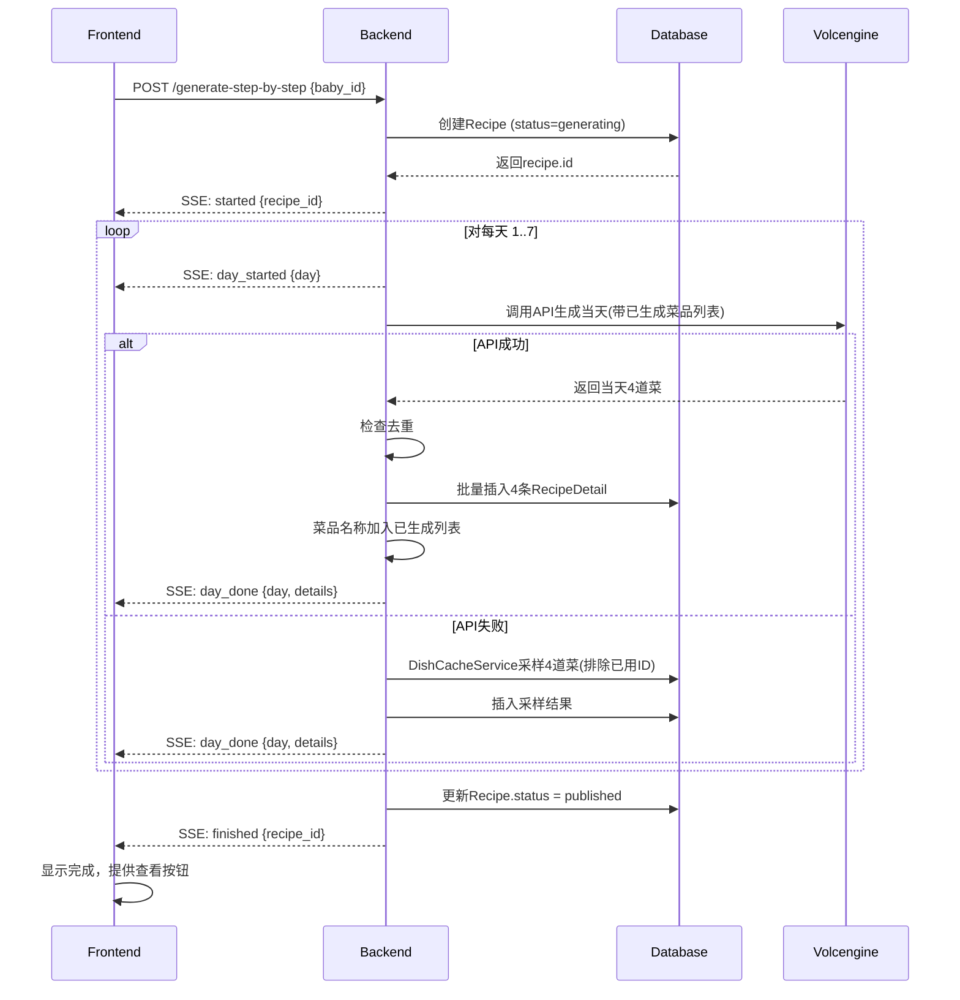

# 分步生成策略实现设计文档

**日期**: 2026-04-16  
**项目**: 宝宝辅食助手  
**问题背景**: 由于火山引擎模型输出长度限制，无法一次性生成完整的一周（28道菜）食谱，需要改成**分步生成策略**：一天一天生成，避开模型长度限制。

---

## 1. 需求回顾与设计目标

### 1.1 核心要求

| 要求 | 说明 |
|------|------|
| **后端改造** | 先创建recipe记录，然后一天一天流式生成，一天生成完保存再生成下一天 |
| **前端改造** | loading页面对应改造，分步生成过程中逐步显示已完成的天 |
| **即时显示** | 每天生成完成就立即显示出来，用户不需要等所有天都生成完 |
| **保证多样性** | 每道菜生成时要求模型避免和已生成的菜品重复 |
| **交互动效** | 已完成的天显示完整食谱，正在生成的天显示进度动画 |

### 1.2 设计目标

- 突破火山引擎模型输出长度限制（单次输出无法容纳28道菜）
- 保持用户体验流畅，用户可以边看边等
- 保证菜品多样性，严格避免重复
- 复用现有架构和错误处理机制
- 保持降级策略可用，API失败时依然能工作

---

## 2. 整体架构设计

### 2.1 前后端分工

```
┌─────────────────────────────────────────────────────────────┐
│                         前端                                  │
│  1. 发起生成请求                                             │
│  2. 接收SSE事件流（每天完成一个推送一个）                     │
│  3. 逐步显示已完成的天，正在生成的天显示进度动画              │
│  4. 用户可以随时切换查看已完成的天                            │
└─────────────┬────────────────────────────────────────────────┘
              │ HTTP + SSE (Server-Sent Events)
              ▼
┌─────────────────────────────────────────────────────────────┐
│                         后端                                  │
│  1. 先创建空Recipe记录（status = "generating"）             │
│  2. For day = 1 to 7:                                        │
│      │   调用火山引擎API生成当天4道菜（单次输出量小）         │
│      │   保存到数据库（RecipeDetail）                         │
│      │   通过SSE推送已完成的当天数据给前端                    │
│      └─ 记录已生成菜品名称列表，下一天生成时传入避免重复      │
│  3. 全部完成后更新Recipe状态为 "published"                   │
│  4. 发送done事件，前端跳转/更新完成状态                       │
└─────────────┬────────────────────────────────────────────────┘
              │
              ▼
┌─────────────────────────────────────────────────────────────┐
│                        数据库                                 │
│  Recipe: 新增 status 字段 (generating / published)          │
│  RecipeDetail: 每天生成后逐条插入                            │
└─────────────────────────────────────────────────────────────┘
```

### 2.2 关键架构变化

| 项 | 原设计 | 新设计 |
|----|--------|--------|
| 生成方式 | 一次性请求生成全部7天28道菜 | 分7次API调用，每天一次 |
| 输出长度 | 单次输出需要容纳28道菜，约10k-15k tokens | 单次只需容纳4道菜，约1.5k-2k tokens，大幅降低 |
| 持久化 | 全部生成完成后批量插入 | 每天生成完成后立即插入 |
| 前端展示 | 等待全部完成后跳转详情页 | 生成过程中即可逐步展示，用户可提前查看已完成天 |

---

## 3. 后端改造方案

### 3.1 数据库变更

**修改 `Recipe` 模型，新增 `status` 字段**：

```python
# 在 app/models.py 中
class Recipe(Base):
    # ... 现有字段 ...
    status = Column(String(20), default="published")  # generating / published
```

迁移说明：
- 现有记录默认设为 "published"
- 新增生成中记录设为 "generating"，完成后更新为 "published"

### 3.2 新增/修改文件清单

| 文件 | 变更类型 | 说明 |
|------|----------|------|
| `backend/app/models.py` | 小改 | Recipe模型新增status字段 |
| `backend/app/routers/recipes.py` | 大改 | 新增 `/generate-step-by-step` 流式接口 |
| `backend/app/services/recipe_generator.py` | 大改 | 新增 `generate_weekly_recipe_step_by_step` 分步生成器 |
| `backend/app/services/recipe_generator.py` | 新增 | `generate_single_day_prompt` 构造单日生成prompt |

### 3.3 分步生成流程

```
1. 前端请求开始生成
   POST /api/recipes/generate-step-by-step
   Body: { baby_id }

2. 后端验证宝宝信息，创建初始Recipe记录
   - recipe.status = "generating"
   - 保存到数据库，获取recipe.id
   通过SSE发送事件:
   data: {"type": "started", "recipe_id": recipe.id}

3. 初始化已生成菜品集合: generated_dishes = []

4. 遍历 day 从 1 到 7:
   a. 构造单日生成prompt，传入 generated_dishes 列表提醒避免重复
   b. 调用火山引擎API生成当天4道菜
   c. 如果API成功:
      - 批量插入4条RecipeDetail记录到数据库
      - 将4道菜的菜名添加到 generated_dishes
      - 通过SSE发送事件:
        data: {"type": "day_done", "day": day, "details": [4道菜品数据]}
   d. 如果API失败:
      - 触发降级，从DishCacheService采样当天4道菜
      - 同样保存并推送
   e. 继续下一天

5. 全部7天完成:
   - 更新 recipe.status = "published"
   - 提交数据库事务
   - 通过SSE发送事件:
     data: {"type": "finished", "recipe_id": recipe.id}

6. 结束SSE流
```

### 3.4 Prompt构造 - 单日生成

新增 `generate_single_day_prompt()` 函数：

```python
def generate_single_day_prompt(
    day_of_week: int,
    baby: Baby,
    generated_dishes: List[str],
    nutrition: NutritionRequirement = None
) -> str:
    prompt = f"""
你是一位专业的婴幼儿营养师，需要为{baby.age_months}个月的宝宝生成**第{day_of_week}天**的辅食食谱。

## 宝宝信息
- 年龄：{baby.age_months}个月
- 进食能力：{baby.feeding_stage}
- 出牙情况：{baby.teething_status}
- 过敏源：{', '.join(baby.allergies) if baby.allergies else '无'}
- 喜欢的食材：{', '.join(baby.liked_ingredients) if baby.liked_ingredients else '无特殊偏好'}
- 不喜欢的食材：{', '.join(baby.disliked_ingredients) if baby.disliked_ingredients else '无'}
- 家庭饮食习惯：{baby.family_diet_style or '无特殊要求'}

## 营养需求（每日辅食部分）
"""
    if nutrition:
        if nutrition.calories_per_day:
            prompt += f"- 能量：{nutrition.calories_per_day} kcal\n"
        if nutrition.protein_g:
            prompt += f"- 蛋白质：{nutrition.protein_g} g\n"
        if nutrition.iron_mg:
            prompt += f"- 铁：{nutrition.iron_mg} mg（重要！）\n"
        if nutrition.calcium_mg:
            prompt += f"- 钙：{nutrition.calcium_mg} mg\n"

prompt += f"""
## 已经生成过的菜品（必须避免重复）
以下是本周已经生成好的菜品名称，今天生成的菜品**绝对不能和这些重复**：
{', '.join(generated_dishes) if generated_dishes else '（暂无，这是第一天）'}

## 要求
1. **必须生成与已有菜品完全不同的菜品**，严格避免和上面列出的菜品重复
2. **必须使用不同的食材组合**，鼓励多样化创新
3. 只需要生成**第{day_of_week}天**的食谱，包含：早餐、午餐、晚餐、加餐（共4餐 = 4道菜）
4. 每道菜必须包含：
   - 菜品名称（中文）
   - 食材清单（含精确用量，如"胡萝卜 50g"）
   - 详细烹饪步骤（分步骤，适合{baby.feeding_stage}阶段的宝宝）
   - 营养信息（能量、蛋白质、铁含量）
5. **严格规避过敏源**
6. **优先使用宝宝喜欢的食材**
7. 确保营养均衡，特别注意铁的补充
8. 食材质地符合{baby.feeding_stage}阶段
9. 烹饪方法安全、简单，适合家庭制作
10. 大胆尝试多样化食材：西兰花、菠菜、香菇、三文鱼、鸭肉、藜麦、燕麦等都可以用

## 输出格式
请严格以JSON格式输出，结构如下：
{{
  "day_of_week": {day_of_week},
  "details": [
    {{
      "meal_type": "breakfast",
      "dish_name": "胡萝卜泥",
      "ingredients": [
        {{"name": "胡萝卜", "amount": "50g"}},
        {{"name": "清水", "amount": "适量"}}
      ],
      "cooking_steps": [
        {{"step": 1, "description": "胡萝卜洗净去皮，切成小块"}},
        ...
      ],
      "nutrition_info": {{
        "calories": 25,
        "protein": 0.5,
        "iron": 0.3
      }}
    }},
    {{
      "meal_type": "lunch",
      ...
    }},
    {{
      "meal_type": "dinner",
      ...
    }},
    {{
      "meal_type": "snack",
      ...
    }}
  ]
}}

注意：
- day_of_week 必须是 {day_of_week}
- meal_type 只能是：breakfast/lunch/dinner/snack
- 确保JSON格式正确，不要有语法错误
- **绝对不能重复已经生成过的菜品：{', '.join(generated_dishes)}**
- **大胆创新，使用多样化食材组合**
"""
    return prompt
```

### 3.5 SSE事件格式定义

| 事件类型 | 数据结构 | 说明 |
|----------|----------|------|
| `started` | `{"type": "started", "recipe_id": number}` | 生成已开始，返回创建的recipe ID |
| `day_started` | `{"type": "day_started", "day": number}` | 开始生成第N天 |
| `day_done` | `{"type": "day_done", "day": number, "details": array[4]}` | 第N天生成完成，返回4道完整菜品数据 |
| `error` | `{"type": "error", "message": string}` | 发生错误 |
| `finished` | `{"type": "finished", "recipe_id": number}` | 全部7天完成 |

### 3.6 多样性保证策略

**多层保障避免重复**：

1. **Prompt级别提醒**：每次生成当天菜品前，在prompt中明确列出已生成的所有菜品名称，要求模型严格避免重复

2. **后端去重校验**：API返回后，后端检查每道菜名称是否与已生成重复，如果重复则自动重试重新生成这道菜

3. **缓存采样排除**：降级模式下，DishCacheService采样时自动排除已使用菜品ID

4. **温度参数保持**：保持 `temperature=0.85`，保证足够随机性促进多样性

**去重算法**：
```python
def has_duplicate_dish(new_dish_name: str, generated_dishes: List[str]) -> bool:
    """检查新菜品是否与已生成的重复（模糊匹配，包含相同关键词也算重复）"""
    new_lower = new_dish_name.lower()
    for existing in generated_dishes:
        existing_lower = existing.lower()
        # 如果互相包含，认为重复
        if new_lower in existing_lower or existing_lower in new_lower:
            return True
    return False
```

如果检测到重复，最多重试2次，依然重复则接受（用户还可以用"换一道"功能）。

### 3.7 错误处理与降级

| 错误场景 | 处理策略 |
|----------|----------|
| 某一天API失败 | 触发降级，使用DishCacheService采样当天4道菜，排除已生成菜品ID，继续流程不中断 |
| 连续多天API失败 | 依然逐天降级，保证能出结果 |
| 网络中断 | 前端显示已生成的天，提示用户剩余部分生成失败，可重试 |
| JSON解析错误 | 最多重试2次，依然失败则触发降级 |

---

## 4. 前端改造方案

### 4.1 新增/修改文件清单

| 文件 | 变更类型 | 说明 |
|------|----------|------|
| `frontend/app/recipes/generate-step-by-step/page.tsx` | 新增 | 分步生成专用页面，支持逐步显示 |
| `frontend/app/recipes/generate/page.tsx` | 保留 | 可考虑重定向到新页面 |

### 4.2 交互设计方案

#### 4.2.1 整体布局

- 顶部标题："AI 正在逐步生成一周食谱"
- 左侧/上部：7天进度卡片，显示每一天状态
  - 已完成：显示"周一 ✅"，可点击查看
  - 当前生成中：显示"周二 🔄 生成中..."，带动画
  - 未开始：显示"周三 等待中..."，灰色
- 下部/右侧：当前选中天的详细食谱展示
  - 已完成：完整显示4道菜
  - 正在生成：显示加载动画
  - 未开始：灰化不可点击

#### 4.2.2 状态流转

```
用户点击"生成食谱"
  ↓
跳转进入 /recipes/generate-step-by-step?baby_id=xxx
  ↓
建立SSE连接，开始接收事件
  ↓
收到 started 事件 → 初始化 recipeId，显示所有天占位
  ↓
收到 day_started → 更新对应天状态为"生成中"，显示脉动动画
  ↓
收到 day_done →
   1. 将4道菜保存到本地状态
   2. 更新天状态为"已完成"
   3. 如果是当前查看的天，立即显示完整食谱
   4. 自动切换到下一天（可选）
  ↓
继续接收后续天
  ↓
收到 finished → 所有天标记完成，提示"生成完成！"，提供按钮进入详情页
```

#### 4.2.3 视觉设计细节

| 状态 | 视觉表现 |
|------|----------|
| **已完成** | 背景绿色，对勾✓，文字黑色，可点击查看详情 |
| **正在生成** | 背景浅粉色，脉动动画（呼吸效果），旋转加载图标，文字粉色 |
| **等待中** | 背景灰色，文字浅灰，不可点击 |

#### 4.2.4 用户交互

- 用户可以**随时点击已完成的天**查看详情，不需要等待全部完成
- 用户可以**随时取消生成**，已生成的天依然保存到数据库，可以后续继续生成或查看
- 生成完成后，提供"查看完整食谱"按钮跳转到常规详情页

### 4.3 前端状态定义

```typescript
interface DayGenerationState {
  day: number;           // 1-7
  status: 'pending' | 'generating' | 'done';
  details?: DishData[];  // 生成完成后有数据
}

interface GenerationState {
  recipeId: number | null;
  days: DayGenerationState[];
  selectedDay: number;   // 当前查看的天
  overallStatus: 'idle' | 'generating' | 'finished' | 'error';
  errorMessage: string;
}
```

### 4.4 交互动效设计

1. **进度脉动效果**：
   - 当前正在生成的天，卡片背景颜色从浅粉到白色周期性渐变（呼吸动画）
   - 旋转小图标持续旋转，清晰提示正在进行中

2. **完成入场动画**：
   - 某天生成完成后，卡片从"生成中"状态平滑过渡到"已完成"状态（颜色渐变 + 对勾缩放动画）
   - 当用户切到已完成天，4道菜从上到下依次淡入，每道菜间隔150ms，营造逐步呈现效果

3. **可点击提示**：
   - 已完成天卡片有悬停阴影效果，提示可点击
   - 鼠标悬停时轻微上浮，符合现代交互风格

4. **内容逐步展示**：
   - 用户切到刚完成的天，食材和步骤逐条渐入，营造流畅的逐步生成感
   - 保持与详情页"换一道菜"相同的动画风格，保持体验一致

### 4.5 响应式布局

- **移动端**：7天进度条横向滚动，内容在下满宽度展示
- **桌面端**：左侧进度条（20%）+ 右侧内容区（80%）并排布局

---

## 5. 多样性保证机制总结

| 层级 | 机制 | 说明 |
|------|------|------|
| 1. Prompt约束 | 每次生成前列出所有已生成菜品名称，要求严格避免重复 | 最直接有效 |
| 2. 后端校验 | API返回后检查菜名相似度，发现重复自动重试 | 兜底保障 |
| 3. 降级排除 | 降级采样时从缓存中排除已用菜品ID | 保证降级模式也不重复 |
| 4. 高温随机性 | temperature=0.85，保持足够随机性 | 促进创新多样 |
| 5. 用户修正 | 保留"换一道菜"功能，用户不满意可随时替换 | 最终保障 |

**为什么这能有效避免重复**：
- 分步生成，每次只生成4道菜，输出长度小，模型能清晰看到完整的已生成列表
- 一次性生成28道菜时，模型容易"忘记"前面生成了什么，导致自重复
- 分步生成每一步都明确提醒，重复概率大大降低

---

## 6. 任务拆分与工作量预估

### 6.1 后端任务

| 任务ID | 任务描述 | 工作量 | 依赖 |
|--------|----------|--------|------|
| BE-SS-01 | 修改 `Recipe` 模型新增 `status` 字段 | 0.25天 | - |
| BE-SS-02 | 在 `recipe_generator.py` 新增 `generate_single_day_prompt` | 0.25天 | - |
| BE-SS-03 | 在 `recipe_generator.py` 新增 `generate_weekly_recipe_step_by_step` 主流程 | 1天 | BE-SS-02 |
| BE-SS-04 | 在 `recipes.py` 新增 `/generate-step-by-step` 路由 | 0.5天 | BE-SS-03 |
| BE-SS-05 | 测试去重逻辑、错误处理、降级流程 | 0.5天 | BE-SS-04 |
| **合计** | | **2.5天** | |

### 6.2 前端任务

| 任务ID | 任务描述 | 工作量 | 依赖 |
|--------|----------|--------|------|
| FE-SS-01 | 新增 `generate-step-by-step/page.tsx` 页面 | 1天 | - |
| FE-SS-02 | 实现SSE连接和事件处理 | 0.5天 | FE-SS-01 |
| FE-SS-03 | 实现进度卡片布局和状态动画 | 0.5天 | FE-SS-01 |
| FE-SS-04 | 实现已完成天内容展示和逐步入场动画 | 0.5天 | FE-SS-03 |
| FE-SS-05 | 响应式适配（移动端 + 桌面端） | 0.25天 | FE-SS-04 |
| FE-SS-06 | 测试交互流程和错误处理 | 0.25天 | FE-SS-05 |
| **合计** | | **3天** | |

### 6.3 测试任务

| 任务ID | 任务描述 | 工作量 |
|--------|----------|--------|
| TEST-SS-01 | 功能测试：分步生成完整7天，验证每天正确保存 | 0.5天 |
| TEST-SS-02 | 功能测试：验证去重机制有效，没有重复菜品 | 0.5天 |
| TEST-SS-03 | 功能测试：某一天API失败，验证降级正常工作 | 0.5天 |
| TEST-SS-04 | 交互测试：验证用户可以随时查看已完成天 | 0.5天 |
| TEST-SS-05 | 动画测试：验证交互动效流畅自然 | 0.25天 |
| TEST-SS-06 | 长时断开网络测试：验证已生成内容保留，错误提示合理 | 0.25天 |
| **合计** | | **2.5天** |

**总工作量预估**：约8人天，可并行开发，实际2-3天完成。

---

## 7. 流程图



---

## 8. 优势对比

| 维度 | 原一次性生成 | 分步生成方案 |
|------|-------------|-------------|
| 模型输出长度要求 | ~12k tokens | ~2k tokens | 满足火山引擎限制 ✅ |
| 用户等待时间 | 需要等全部完成才能看 | 生成好的天立即看 | 更好体验 ✅ |
| 重复概率 | 模型容易忘记前面生成了什么，自重复概率高 | 每一步明确列出已生成菜品，重复概率低 | 更好多样性 ✅ |
| 失败影响 | 一次失败全功尽弃，必须重试 | 失败天降级，已生成天保留 | 更高鲁棒性 ✅ |
| 实现复杂度 | 简单 | 略复杂，但结构清晰 | 可接受 |

---

## 9. Critical Files for Implementation

/Users/jiayindeng/宝宝辅食项目/backend/app/models.py
/Users/jiayindeng/宝宝辅食项目/backend/app/routers/recipes.py
/Users/jiayindeng/宝宝辅食项目/backend/app/services/recipe_generator.py
/Users/jiayindeng/宝宝辅食项目/frontend/app/recipes/generate-step-by-step/page.tsx
/Users/jiayindeng/宝宝辅食项目/frontend/app/recipes/[id]/page.tsx
